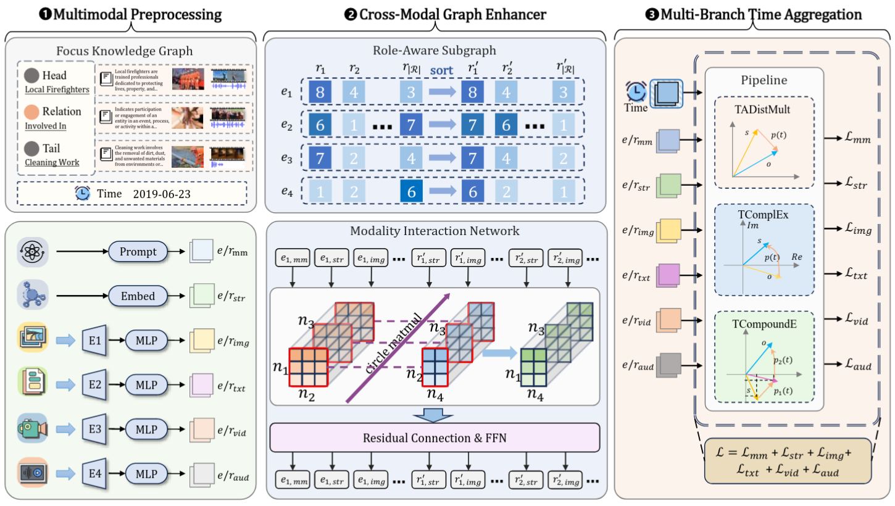

<h1 align="center">
  DTME
</h1>

<h4 align="center">FocusKG: A Novel Multimodal Knowledge Graph Dataset with Temporal Information for Link Prediction</h4>

<h2 align="center">
  Overview of DTME
  
</h2>


This paper has been submitted to the TKDE.

### Dependencies

- python            3.10.13
- torch             2.1.1+cu118
- numpy             1.26.3
- transformers      4.44.1

### Dataset:

- We constructe a new discrete temporal multimodal knowledge graph dataset: FocusKG. 
- We use WN18RR++, FB15K237, and VTKG-I dataset for knowledge graph link prediction. 

### Results:
The results are:

| Dataset  | MRR  | H@1  | H@3  | H@10 |
| :------: | :--: | :--: | :--: | :--: |
| FocusKG  | 41.7 | 32.0 | 51.4 | 63.6 |
| WN18RR++ | 55.6 | 48.9 | 57.9 | 67.6 |
| FB15K237 | 37.3 | 28.0 | 40.9 | 56.7 |
|  VTKG-I  | 48.7 | 40.8 | 50.5 | 64.7 |

### Data:

You should first download the pre-trained multi-modal embeddings from [Google Drive](https://drive.google.com/drive/folders/14iKzph_qBumkPYOCzV9yTaoDIAwUULak?usp=sharing) and put them in the `data/` path.

## How to Run

```
python train --data FocusKG --lr 0.0008 --dim 512 --num_epoch 750 --valid_epoch 50 --exp best --hidden_dim 2048 --dropout 0.1 --emb_dropout 0.5 --img_dropout 0.1 --txt_dropout 0.5 --vid_dropout 0.5 --aud_dropout 0.2 --time_dropout 0.7 --smoothing 0.0 --batch_size 1024 --decay 0.0 --step_size 50   ## FocusKG

python train --data WN18RR++ --lr 0.001 --dim 256 --num_epoch 750 --valid_epoch 50 --exp best --hidden_dim 2048 --dropout 0.1 --emb_dropout 0.6 --img_dropout 0.3 --txt_dropout 0.4 --vid_dropout 0 --aud_dropout 0 --time_dropout 0 --smoothing 0.0 --batch_size 1024 --decay 0.0 --step_size 50   ## WN18RR++

python train --data FB15K237 --lr 0.0001 --dim 256 --num_epoch 750 --valid_epoch 50 --exp best --hidden_dim 2048 --dropout 0.1 --emb_dropout 0.8 --img_dropout 0.4 --txt_dropout 0.1 --vid_dropout 0 --aud_dropout 0 --time_dropout 0 --smoothing 0.0 --batch_size 512 --decay 0.0 --step_size 50   ## FB15K237

python train --data VTKG-I --lr 0.001 --dim 256 --num_epoch 150 --valid_epoch 50 --exp best --hidden_dim 2048 --dropout 0.1 --emb_dropout 0.7 --img_dropout 0.5 --txt_dropout 0.6 --vid_dropout 0 --aud_dropout 0 --time_dropout 0 --smoothing 0.0 --batch_size 128 --decay 0.0 --step_size 50   ## VTKG-I
```

### Related links:

I hereby list some code repositories of baselines used in the paper to enhance reproducibility.

PairRE: https://github.com/alipay/KnowledgeGraphEmbeddingsViaPairedRelationVectors_PairRE

CompoundE: https://github.com/hughxiouge/CompoundE

ComplEx-SS: https://github.com/IIE-UCAS/Knowledge-Embedding-with-Double-Loss

TeRo/ATiSE: https://github.com/soledad921/ATISE

TComplEx: https://github.com/facebookresearch/tkbc

TCompoundE: https://github.com/nk-ruiying/TCompoundE

APKGC：https://github.com/HubuKG/APKGC

OTKGE：https://github.com/Lion-ZS/OTKGE

IMF：https://github.com/HestiaSky/IMF-Pytorch

VISTA：https://github.com/bdi-lab/VISTA

NativE: https://github.com/zjukg/NATIVE

QEB: https://github.com/Darkbblue/tiva-kg

MyGO: https://github.com/zjukg/MyGO

MoMoK: https://github.com/zjukg/MoMoK

